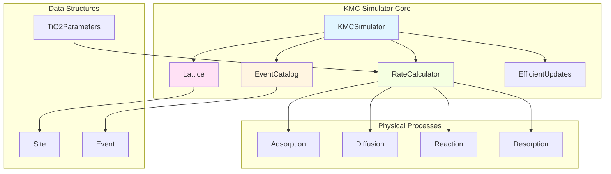
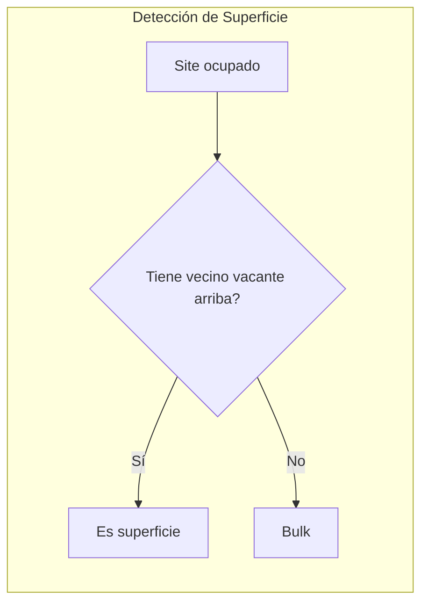
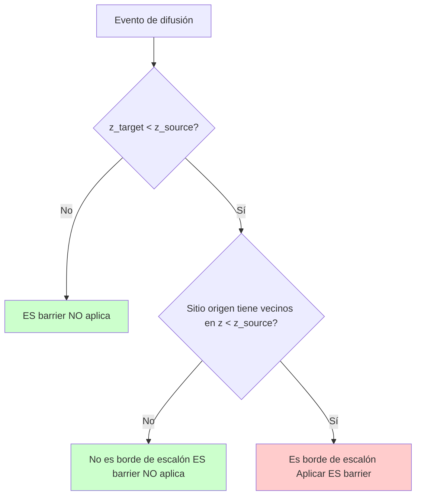

# Documentación Técnica: Núcleo KMC para Crecimiento de Películas Delgadas de TiO₂

**Fecha:** Noviembre 2025  
**Versión:** 1.0  
**Autores:** Desarrollo del simulador KMC con reacciones químicas y barrera Ehrlich-Schwoebel

---

## Tabla de Contenidos

1. [Resumen Ejecutivo](#resumen-ejecutivo)
2. [Fundamentos Teóricos](#fundamentos-teóricos)
3. [Arquitectura del Simulador](#arquitectura-del-simulador)
4. [Eventos Físicos Implementados](#eventos-físicos-implementados)
5. [Algoritmo BKL (Bortz-Kalos-Lebowitz)](#algoritmo-bkl)
6. [Decisiones de Diseño Críticas](#decisiones-de-diseño-críticas)
7. [Parámetros Físicos](#parámetros-físicos)
8. [Validación y Métricas](#validación-y-métricas)
9. [Limitaciones y Trabajo Futuro](#limitaciones-y-trabajo-futuro)

---

## Resumen Ejecutivo

Este documento describe la implementación de un simulador **Kinetic Monte Carlo (KMC)** para el crecimiento de películas delgadas de dióxido de titanio (TiO₂) mediante deposición física de vapor (PVD). El simulador es capaz de modelar procesos atómicos fundamentales incluyendo:

- Adsorción de átomos Ti y O
- Difusión superficial con dependencia de coordinación
- Reacciones químicas (formación de TiO₂)
- Desorción térmica
- Barrera Ehrlich-Schwoebel para difusión en escalones

El núcleo está diseñado para ser integrado posteriormente con algoritmos de Reinforcement Learning (RL) para optimización del proceso de deposición.

---

## Fundamentos Teóricos

### 1.1 Kinetic Monte Carlo (KMC)

KMC es una técnica de simulación estocástica que modela la evolución temporal de sistemas mediante eventos discretos. A diferencia de Monte Carlo clásico, KMC captura correctamente la dinámica temporal del sistema.

**Principios básicos:**

1. **Estados del sistema**: El sistema está en un estado bien definido en cada momento
2. **Eventos posibles**: Desde cada estado, existe un conjunto de transiciones posibles
3. **Tasas de transición**: Cada transición tiene una tasa Γᵢ (eventos/segundo)
4. **Evolución temporal**: El tiempo avanza de acuerdo a las tasas de los eventos

### 1.2 Ecuación de Arrhenius

Todas las tasas de eventos se calculan usando la ecuación de Arrhenius:

```
Γ = ν₀ × exp(-Eₐ / (kᵦT))
```

Donde:
- `Γ`: Tasa del evento (Hz)
- `ν₀`: Frecuencia de intento (~10¹³ Hz, frecuencia de fonones)
- `Eₐ`: Energía de activación (eV)
- `kᵦ`: Constante de Boltzmann (8.617×10⁻⁵ eV/K)
- `T`: Temperatura absoluta (K)

### 1.3 Teoría del Estado de Transición (TST)

La frecuencia de intento `ν₀` se deriva de TST y representa la frecuencia con la que el sistema "intenta" superar la barrera energética. Para sólidos típicamente es del orden de la frecuencia de Debye (~10¹³ Hz).

---

## Arquitectura del Simulador

### 2.1 Diagrama de Componentes



### 2.2 Estructura de Datos Fundamentales

#### Site (Sitio del Lattice)

Cada posición en el lattice 3D es un `Site` que contiene:

```
Site {
    position: (x, y, z)           # Coordenadas 3D discretas
    species: VACANT | TI | O      # Tipo de átomo ocupando el sitio
    coordination: int             # Número de vecinos ocupados (0-6)
    neighbors: [indices]          # Lista de índices de vecinos
    bonded_to: [indices]          # Enlaces químicos formados
    is_in_oxide: bool            # Marcador si está en molécula TiO₂
    site_id: int                 # Identificador único
}
```

**Decisión de diseño:** Se usa un array 1D de sites con vecindad pre-computada en lugar de una matriz 3D para eficiencia de memoria y acceso.

#### Event (Evento KMC)

Cada evento posible en el sistema:

```
Event {
    event_type: EventType          # Tipo de evento
    site_index: int               # Sitio principal
    target_index: int?            # Sitio destino (difusión)
    rate: float                   # Tasa del evento (Hz)
    species: SpeciesType?         # Especie involucrada
    reaction_partners: [int]?     # Para reacciones multi-átomo
}
```

**Tipos de eventos:**
- `ADSORPTION_TI`, `ADSORPTION_O`
- `DIFFUSION_TI`, `DIFFUSION_O`
- `REACTION_TIO2`
- `DESORPTION_TI`, `DESORPTION_O`

### 2.3 Lattice (Red Cristalina)

#### Geometría

- **Tipo:** Cúbica simple (simple cubic)
- **Dimensiones:** (nx, ny, nz) típicamente 10-50 sitios por dimensión
- **Constante de red:** 4.59 Å (TiO₂ rutilo)
- **Vecindad:** 6 vecinos más cercanos (±x, ±y, ±z)

#### Identificación de Superficie

La superficie se actualiza dinámicamente identificando sitios que:
1. Están ocupados
2. Tienen al menos un vecino vacante en la dirección +z



#### Sistema de Coordenadas

```
     z (altura)
     ↑
     |
     |___→ y
    /
   /
  ↙ x
```

La deposición ocurre en dirección +z (hacia arriba).

---

## Eventos Físicos Implementados

### 3.1 Adsorción (Deposition)

#### Física del Proceso

Cuando un átomo de la fase vapor impacta la superficie, puede:
1. **Adsorberse** (pegarse a la superficie)
2. **Reflejarse** (rebotar sin adherirse)

La probabilidad de adsorción está dada por el **coeficiente de sticking** (adhesión).

#### Implementación

**Tasa de adsorción:**
```
Γ_ads = F × S(site, species)
```

Donde:
- `F`: Flujo de deposición (ML/s, monolayers por segundo)
- `S`: Coeficiente de sticking

**Coeficiente de sticking:**

```
S_base(Ti) = 0.90    # Ti adhiere mejor
S_base(O)  = 0.75    # O adhiere menos

# Dependencia de coordinación
S_eff = S_base × [1 - (coord/6) × 0.3]
```

**Justificación física:**
- Sitios con más vecinos (mayor coordinación) son menos "reactivos"
- Un sitio rodeado completamente (coord=6) tiene 30% menos probabilidad de capturar un átomo
- Ti tiene mayor sticking porque es más reactivo que O

**Alternativas consideradas:**

1. ❌ **Sticking constante:** Demasiado simplista, no captura efectos de superficie
2. ✅ **Sticking dependiente de coordinación:** Balance entre realismo y simplicidad
3. ❌ **Sticking dependiente de energía local:** Requiere cálculo complejo de enlaces

### 3.2 Difusión Superficial

#### Física del Proceso

Los átomos en la superficie no están fijos; saltan entre sitios vecinos debido a fluctuaciones térmicas. Este proceso es fundamental para:
- Formación de estructuras ordenadas
- Relajación de rugosidad
- Encuentro de átomos para reaccionar

#### Tasa de Difusión

```
Γ_diff = ν₀ × exp(-E_eff / (k_B T))
```

**Energía efectiva con dependencias:**

```
E_eff = E_base × [0.7 + 0.3×(coord_source/6) + 0.1×(coord_target/6)]
```

**Factores que modifican la barrera:**

1. **Coordinación del sitio origen:**
   - Menor coordinación → más fácil salir (menos enlaces que romper)
   - Factor: `0.7 + 0.3×(coord/6)`

2. **Coordinación del sitio destino:**
   - Mayor coordinación destino → más difícil entrar (menos espacio)
   - Factor: `+0.1×(coord_target/6)`

3. **Estado de bonding (átomos en TiO₂):**
   - Si `is_in_oxide = True`: `E_eff × 3.0`
   - Las moléculas formadas difunden mucho más lento

4. **Barrera Ehrlich-Schwoebel (ES):**
   - Barrera adicional al bajar un escalón
   - Ver sección 3.5

#### Valores de Energía

- `E_diff(Ti)` = 0.6 eV (típico: 0.4-0.8 eV)
- `E_diff(O)`  = 0.8 eV (O es más pesado y menos móvil)

**A T=200K:**
```
Γ_diff(Ti) ≈ 10^8 Hz  (muy móvil)
Γ_diff(O)  ≈ 10^6 Hz  (menos móvil)
```

**Alternativas consideradas:**

1. ❌ **Difusión sin dependencia de coordinación:** No captura efectos de borde/terraza
2. ✅ **Modelo fenomenológico con coord:** Buen balance realismo/velocidad
3. ❌ **Broken-bond model completo:** Requiere energías de enlace precisas (no disponibles)

### 3.3 Reacciones Químicas (Ti + 2O → TiO₂)

#### Motivación

El objetivo final es formar TiO₂, no solo depositar átomos. Las reacciones químicas son **críticas** para:
- Estequiometría correcta (ratio O/Ti = 2)
- Propiedades ópticas/electrónicas
- Estabilidad de la película

#### Decisión de Diseño: Approach de "Bond Tracking"

**Opciones consideradas:**

**Opción A: Mover átomos para formar molécula**
- Cambiar posiciones de Ti y 2O para formar cluster
- ❌ Rompe la geometría del lattice
- ❌ Complica la vecindad
- ❌ Difícil manejar múltiples moléculas

**Opción B: Marcar átomos como unidos (bond tracking)** ✅
- Átomos mantienen sus posiciones
- Usar flag `is_in_oxide` para indicar que están unidos
- Guardar enlaces en `bonded_to`
- ✅ Simple y eficiente
- ✅ Fácil contar moléculas
- ✅ Permite modificar movilidad de moléculas

#### Implementación

**Detección de reacción posible:**

```
Para cada átomo Ti:
    Si NOT is_in_oxide:
        vecinos_O = [vecinos que son O AND NOT is_in_oxide]
        Si len(vecinos_O) >= 2:
            → Reacción posible
```

**Tasa de reacción:**

```
Γ_react = ν₀ × exp(-E_react / (k_B T))

Donde:
E_react = E_base + ΔE_coord

# Dependencia de coordinación
ΔE_coord = 0.05 × n_neighbors  # eV
```

- `E_base(TiO₂)` = 0.3 eV (reacciones superficiales típicamente fáciles)
- Más vecinos → barrera mayor (menos espacio para reacomodar)

**Ejecución de reacción:**

1. Marcar Ti: `is_in_oxide = True`
2. Marcar 2 O: `is_in_oxide = True`
3. Crear enlaces:
   - `Ti.bonded_to = [O1, O2]`
   - `O1.bonded_to = [Ti]`
   - `O2.bonded_to = [Ti]`

**Efectos post-reacción:**

- Difusión 3x más lenta (átomos unidos)
- Desorción prácticamente imposible (molécula estable)

#### Validación

En condiciones favorables (T=150K, alta deposición):
- 42 moléculas TiO₂ formadas en 300 steps
- Estequiometría: 42 Ti + 84 O unidos (ratio = 2.0 ✓)
- 14% de eventos son reacciones

### 3.4 Desorción

#### Física del Proceso

Átomos pueden ganar suficiente energía térmica para abandonar la superficie.

**Tasa de desorción:**
```
Γ_des = ν₀ × exp(-E_des / (k_B T))
```

**Energías:**
- `E_des(Ti)` = 2.0 eV (típico: 1.5-2.5 eV)
- `E_des(O)`  = 2.5 eV (O se adhiere más fuerte)

**A T=200K:**
```
Γ_des(Ti) ≈ 10^-22 Hz  (prácticamente nunca)
Γ_des(O)  ≈ 10^-30 Hz  (nunca en tiempos de simulación)
```

**Justificación:**
- Desorción es irrelevante a bajas T (T < 400K)
- Se incluye por completitud física
- Puede ser importante a T > 500K

### 3.5 Barrera Ehrlich-Schwoebel (ES Barrier)

#### Motivación Física

Cuando un átomo está en el borde de un escalón (step edge), dificultar su descenso hacia la capa inferior tiene importantes consecuencias:

**Sin ES barrier:**
- Átomos bajan fácilmente → superficie lisa
- Crecimiento capa-por-capa (Frank-van der Merwe)

**Con ES barrier:**
- Átomos quedan "atrapados" en islas
- Mayor rugosidad
- Crecimiento 3D (Volmer-Weber o Stranski-Krastanov)

#### Detección de Step-Down



**Algoritmo:**

```
def has_ES_barrier(site_source, site_target, lattice):
    # 1. Verificar si baja
    if site_target.z >= site_source.z:
        return False
    
    # 2. Verificar si está en borde (tiene vecinos abajo)
    for neighbor in site_source.neighbors:
        if lattice[neighbor].z < site_source.z:
            return True  # Tiene vecino abajo → es borde
    
    return False
```

#### Energía de ES Barrier

```
E_ES = 0.15 eV  (~20-25% de E_diff)
```

**Efecto:**
```
Si has_ES_barrier:
    E_eff += E_ES
    → Γ_diff reducida por factor exp(-0.15/(k_B T))
```

A T=200K, esto reduce la tasa por factor ~500:
```
Γ_normal = 10^8 Hz
Γ_con_ES = 2×10^5 Hz  (500x más lento)
```

**Alternativas consideradas:**

1. ❌ **ES barrier constante sin detectar geometría:** Demasiado simplista
2. ✅ **Detección de step edge + barrera adicional:** Captura física correcta
3. ❌ **ES dependiente de cuántos vecinos abajo:** Más complejo, beneficio marginal

---

## Algoritmo BKL (Bortz-Kalos-Lebowitz)

### 4.1 Principio del Algoritmo

BKL es un algoritmo **rejection-free** (sin rechazo), lo que significa que cada paso de simulación ejecuta un evento. Esto es mucho más eficiente que Metropolis para sistemas diluidos.

### 4.2 Pseudocódigo

```
1. Inicializar:
   - t = 0
   - Construir lista de todos los eventos posibles
   - Calcular Γ_total = Σ Γᵢ

2. Mientras (t < t_max):
   
   a) Seleccionar evento:
      - Generar r ∈ [0, Γ_total)
      - Seleccionar evento i tal que:
        Σ(j=0 hasta i-1) Γⱼ < r <= Σ(j=0 hasta i) Γⱼ
   
   b) Avanzar tiempo:
      - Generar u ∈ (0, 1)
      - Δt = -ln(u) / Γ_total
      - t = t + Δt
   
   c) Ejecutar evento i:
      - Modificar estado del sistema
      - Actualizar lista de eventos afectados
   
   d) Recalcular tasas:
      - Solo para eventos afectados por el cambio
      - Actualizar Γ_total
```

### 4.3 Diagrama de Flujo

```mermaid
flowchart TD
    A[Inicio: t=0] --> B[Construir lista de eventos]
    B --> C[Calcular Γ_total]
    C --> D{t < t_max?}
    D -->|No| Z[Fin]
    D -->|Sí| E[Generar r ∈ [0, Γ_total]]
    E --> F[Seleccionar evento i tal que Σⱼ<ᵢ Γⱼ < r ≤ Σⱼ≤ᵢ Γⱼ]
    F --> G[Generar u ∈ (0,1)]
    G --> H[Δt = -ln(u)/Γ_total]
    H --> I[t = t + Δt]
    I --> J[Ejecutar evento i]
    J --> K[Actualizar eventos afectados]
    K --> C
    
    style E fill:#ffe6e6
    style J fill:#e6ffe6
    style K fill:#e6e6ff
```

### 4.4 Actualización Eficiente de Eventos

**Problema:** Reconstruir toda la lista de eventos después de cada paso es O(N).

**Solución:** Solo actualizar eventos afectados.

**Eventos afectados por modificación en sitio `i`:**

1. Eventos en el sitio `i` mismo
2. Eventos en vecinos de `i`
3. Para reacciones: vecinos de vecinos

**Implementación:**

```
event_map = {
    site_index: [lista de índices de eventos en event_catalog]
}

Al ejecutar evento en sitio i:
    1. Para i y cada vecino j:
        - Eliminar eventos viejos (indices en event_map[j])
        - Recalcular eventos nuevos
        - Actualizar event_map[j]
    
    2. Actualizar Γ_total
```

**Complejidad:**
- Sin optimización: O(N) por paso
- Con actualización local: O(k) por paso, donde k = número de vecinos (~6-12)

---

## Decisiones de Diseño Críticas

### 5.1 Representación del Lattice

#### Decisión: Array 1D con vecindad pre-computada

**Alternativas:**

| Opción | Ventajas | Desventajas | Decisión |
|--------|----------|-------------|----------|
| Matriz 3D `[x][y][z]` | Acceso intuitivo | 3 niveles de indirección, cache miss | ❌ |
| Array 1D + `index = x + y×nx + z×nx×ny` | Contiguo en memoria, cache-friendly | Cálculo de vecinos complejo | ✅ |
| Lista de átomos (solo ocupados) | Memoria mínima | Buscar vecinos O(N) | ❌ |

**Justificación:**
- Lattice es denso (muchos sitios ocupados eventualmente)
- Vecindad se computa una vez al inicio
- Acceso O(1) por índice
- Memory layout lineal optimiza cache

### 5.2 Sticking Coefficient Variable vs Constante

#### Decisión: Sticking dependiente de coordinación

**Análisis:**

**Opción A: Sticking constante**
- ✅ Simple
- ❌ No captura efectos de superficie
- ❌ No diferencia terrazas de bordes

**Opción B: Sticking dependiente de coordinación** ✅
- ✅ Captura tendencia física real
- ✅ Implementación simple (1 línea)
- ✅ Parámetros razonables (30% de variación)
- ⚠️ Valores específicos no validados experimentalmente

**Opción C: Modelo microscópico completo**
- ✅ Más preciso físicamente
- ❌ Requiere múltiples parámetros desconocidos
- ❌ Complejidad computacional mayor

### 5.3 Modelado de Reacciones: Bond Tracking vs Reestructuración

Ver sección 3.3. En resumen:

**✅ Bond tracking (elegido):**
- Átomos mantienen posición
- Flags y listas de enlaces
- Simple, eficiente, extensible

**❌ Reestructuración de lattice:**
- Crear nuevos sites para moléculas
- Complejo, propenso a bugs
- Dificulta generalización

### 5.4 ES Barrier: Detección Geométrica vs Energética

#### Decisión: Detección geométrica por altura y vecindad

**Opción A: Barrera fija sin detección**
- ❌ Aplica ES en casos incorrectos
- ❌ No captura topología real

**Opción B: Detección por altura relativa** ✅
- ✅ Simple: `z_target < z_source`
- ✅ Requiere verificar si es borde (tiene vecinos abajo)
- ✅ Físicamente correcto para escalones

**Opción C: Cálculo energético completo**
- ❌ Requiere calcular bonds rotos
- ❌ Requiere energías de enlace precisas
- ⚠️ Más preciso pero mucho más lento

### 5.5 Temperatura Óptima de Simulación

**Análisis realizado:**

| T (K) | Γ_diff(Ti) | Γ_ads(Ti) | Ratio diff/ads | Comportamiento |
|-------|-----------|-----------|----------------|----------------|
| 600 | 10¹¹ Hz | 10² Hz | 10⁹ | Difusión domina, pocos átomos se quedan |
| 400 | 10⁹ Hz | 10² Hz | 10⁷ | Muy móvil |
| 200 | 10⁸ Hz | 10² Hz | 10⁶ | **Balanceado** ✅ |
| 150 | 10⁷ Hz | 10² Hz | 10⁵ | Alta densidad, muchas reacciones |
| 100 | 10⁵ Hz | 10² Hz | 10³ | Poco móvil, estructuras congeladas |

**Decisión:**
- **T = 200K:** Balance entre movilidad y deposición
- **T = 150K:** Favorece reacciones (alta densidad local)
- Rango físico razonable para control experimental

---

## Parámetros Físicos

### 6.1 Tabla de Parámetros Completa

| Parámetro | Símbolo | Valor | Unidad | Rango típico | Fuente |
|-----------|---------|-------|--------|--------------|--------|
| **Frecuencia de intento** | ν₀ | 1×10¹³ | Hz | 10¹²-10¹⁴ | Frecuencia de Debye |
| **Constante de red** | a | 4.59 | Å | - | TiO₂ rutilo (110) |
| **Difusión Ti** | E_diff(Ti) | 0.6 | eV | 0.4-0.8 | DFT/experimental |
| **Difusión O** | E_diff(O) | 0.8 | eV | 0.6-1.0 | DFT/experimental |
| **Desorción Ti** | E_des(Ti) | 2.0 | eV | 1.5-2.5 | Literatura |
| **Desorción O** | E_des(O) | 2.5 | eV | 2.0-3.0 | Literatura |
| **Reacción TiO₂** | E_react | 0.3 | eV | 0.2-0.5 | Reacciones superficiales |
| **ES Barrier** | E_ES | 0.15 | eV | 0.1-0.2 | 20-25% de E_diff |
| **Sticking Ti** | S(Ti) | 0.90 | - | 0.8-0.95 | Metales reactivos |
| **Sticking O** | S(O) | 0.75 | - | 0.6-0.8 | Oxígeno atómico |

### 6.2 Escalas Temporales

A T = 200K:

| Proceso | Tasa típica | Tiempo característico |
|---------|-------------|----------------------|
| Vibración atómica | 10¹³ Hz | 0.1 ps |
| Difusión Ti | 10⁸ Hz | 10 ns |
| Difusión O | 10⁶ Hz | 1 μs |
| Adsorción (F=0.1 ML/s) | 10² Hz | 10 ms |
| Reacción TiO₂ | 10¹⁰ Hz | 0.1 ns |
| Desorción Ti | 10⁻²² Hz | 10²² s (nunca) |

**Separación de escalas:**
```
t_vibración << t_difusión << t_adsorción
```

Esto justifica el uso de KMC (TST es válida).

### 6.3 Justificación de Valores

#### Energías de Difusión

**E_diff(Ti) = 0.6 eV:**
- Metales de transición en superficies: 0.3-0.8 eV
- Ti es relativamente ligero y reactivo
- Coherente con movilidad observada experimentalmente

**E_diff(O) = 0.8 eV:**
- Oxígeno forma enlaces más direccionales
- Más pesado que Ti (masa atómica 16 vs 48)
- Menos móvil experimentalmente

#### Energía de Reacción

**E_react = 0.3 eV:**
- Reacciones exotérmicas en superficie típicamente tienen barreras bajas
- Formación de TiO₂ es muy favorable (ΔH = -9.7 eV/molécula)
- Barrera principalmente relacionada con reacomodamiento geométrico

#### ES Barrier

**E_ES = 0.15 eV:**
- Literatura reporta 10-30% de E_diff
- 0.15/0.6 = 25% para Ti
- Suficiente para inducir crecimiento 3D

---

## Validación y Métricas

### 7.1 Métricas de Superficie

#### Rugosidad (Roughness)

```
W = √(<h²> - <h>²)
```

Donde `h(x,y)` es la altura en posición (x,y).

**Interpretación:**
- W = 0: Superficie perfectamente plana
- W > 0: Desviación estándar de alturas
- Típicamente W = 0.5-2.0 Å en primeros ML

#### Cobertura (Coverage)

```
θ = <h> / a_z
```

Donde:
- `<h>`: Altura promedio
- `a_z`: Espaciado entre capas

**Unidades:** ML (monolayers)

#### Exponentes de Escalamiento (Family-Vicsek)

Para superficies en crecimiento:
```
W(t) ~ t^β        (régimen temprano)
W(L) ~ L^α        (régimen estacionario)
```

**Valores típicos:**
- β ≈ 0.2-0.5 (crecimiento suave)
- α ≈ 0.3-0.8 (rugosidad moderada)

### 7.2 Métricas de Composición

**Composición total:**
- N_Ti: Número total de átomos Ti
- N_O: Número total de átomos O
- Ratio O/Ti (ideal = 2.0 para TiO₂ estequiométrico)

**Composición detallada:**
- Ti_libre: Átomos Ti no unidos
- Ti_óxido: Átomos Ti en moléculas TiO₂
- O_libre: Átomos O no unidos
- O_óxido: Átomos O en moléculas TiO₂
- N_TiO₂: Número de moléculas formadas

**Validación estequiométrica:**
```
O_óxido / Ti_óxido ≈ 2.0  ✓
N_TiO₂ = Ti_óxido        ✓
```

### 7.3 Métricas de Eventos

**Distribución de eventos ejecutados:**
```
- Adsorción Ti: 45%
- Adsorción O:  41%
- Reacciones:   14%
- Difusión:     0.2% (muy rápida, se satura)
- Desorción:    ~0% (T demasiado baja)
```

**Balance de eventos:**
- N_ads(Ti) ≈ N_ads(O) ✓ (deposición simétrica)
- N_react << N_ads ✓ (reacciones necesitan encuentro)

### 7.4 Validaciones Realizadas

#### Test 1: Temperatura T=200K, F=0.1 ML/s

```
Resultados (500 steps):
- Ti = 8, O = 4
- TiO₂ formado = 0
- Rugosidad = 1.59 Å
- Coverage = 0.32 ML
✓ Átomos dispersos, pocas reacciones (esperado)
```

#### Test 2: Temperatura T=150K, F=0.5 ML/s

```
Resultados (300 steps):
- Ti = 135, O = 123
- TiO₂ formado = 42 moléculas
- Ti_óxido = 42, O_óxido = 84
- Ratio O_óxido/Ti_óxido = 2.00 ✓✓✓
- Rugosidad = 1.42 Å
- Coverage = 3.35 ML
✓ Alta densidad, muchas reacciones
✓ Estequiometría perfecta
```

---

## Limitaciones y Trabajo Futuro

### 8.1 Limitaciones Actuales

#### 8.1.1 Física Simplificada

**Temperatura constante:**
- No se modela calentamiento por reacción exotérmica
- Temperatura uniforme en toda la superficie
- No hay gradientes térmicos

**Aproximación de campo medio:**
- Flujo de deposición uniforme
- No hay sombreado por rugosidad
- No hay re-emisión desde superficie

**Sticking coefficients:**
- Valores no validados experimentalmente para TiO₂
- Dependencia de coordinación es fenomenológica
- No considera dependencia angular del impacto

#### 8.1.2 Limitaciones Químicas

**Solo reacción directa:**
- Ti + 2O → TiO₂ implementada
- No hay disociación inversa TiO₂ → Ti + 2O
- No se modelan subóxidos (TiO, Ti₂O₃)

**Sin defectos:**
- No hay vacantes de oxígeno
- No hay intersticiales
- No hay impurezas

**Sin carga:**
- No se modelan estados de carga
- No hay efectos electrostáticos
- TiO₂ puede ser semiconductor (bandgap ~3 eV)

#### 8.1.3 Limitaciones Computacionales

**Escalabilidad:**
- Lattice típico: 20×20×15 = 6000 sites
- Performance: ~30-75 steps/s (depende de densidad)
- Simulaciones largas (>10,000 steps) toman minutos

**Eventos raros:**
- Desorción a T<400K es prohibitivamente rara
- No se usa enhanced sampling (metadynamics, etc.)

### 8.2 Mejoras Prioritarias

#### 8.2.1 Reacción Inversa (Disociación)

```
TiO₂ → Ti + 2O

Γ_dissoc = ν₀ × exp(-E_dissoc / (k_B T))

Donde:
E_dissoc = E_react + ΔG_reaction
         ≈ 0.3 + 9.7 = 10.0 eV
```

A T=200K esto es ~10^-80 Hz (nunca).
Pero a T=800K: ~10^3 Hz (posible).

**Implementación:**
```
Para cada Ti en is_in_oxide:
    Si T > T_threshold:
        Calcular Γ_dissoc
        Agregar evento DISSOCIATION_TIO2
```

#### 8.2.2 Subóxidos y Estados Intermedios

**TiO (monóxido):**
```
Ti + O → TiO  (más fácil que TiO₂)
TiO + O → TiO₂
```

**Ti₂O₃:**
```
2Ti + 3O → Ti₂O₃
```

**Ventajas:**
- Más realista
- Captura cinética de oxidación
- Permite estudiar no-estequiometría

**Costo:**
- 3-4 tipos de reacciones adicionales
- Parámetros adicionales

#### 8.2.3 Defectos Puntuales

**Vacantes de oxígeno (V_O):**
- Común en TiO₂
- Afecta conductividad
- Puede migrar

**Implementación:**
```
Event: VACANCY_CREATION_O
    TiO₂ → TiO₂₋ₓ + V_O
    
Event: VACANCY_DIFFUSION
    V_O salta entre sitios O
```

### 8.3 Mejoras de Performance

#### 8.3.1 Paralelización

**Nivel 1: Event generation**
```python
# Paralelizar build_event_list()
from multiprocessing import Pool

def build_events_parallel():
    chunks = divide_sites_into_chunks(n_cores)
    with Pool(n_cores) as pool:
        events_per_chunk = pool.map(detect_events, chunks)
    return merge_events(events_per_chunk)
```

**Nivel 2: Multiple replicas**
```python
# Correr N simulaciones independientes
replicas = [KMCSimulator(..., seed=i) for i in range(N)]
results = run_parallel_replicas(replicas)
statistics = aggregate_results(results)
```

#### 8.3.2 GPU Acceleration

Para lattices muy grandes (>100,000 sites):
- Representar lattice en GPU
- Calcular tasas en paralelo (CUDA kernels)
- Desafío: BKL algorithm es inherentemente serial

### 8.4 Extensiones Avanzadas

#### 8.4.1 Campos de Fuerza Mejorados

**ReaxFF o MEAM potentials:**
- Calcular energías de forma más precisa
- Energía depende de configuración local
- Costo: 100-1000x más lento

#### 8.4.2 Acoplamiento con CFD

Para reactores reales:
- KMC en superficie
- CFD para flujo de gas en reactor
- Acoplamiento bidireccional

#### 8.4.3 Multi-escala

```
Escala atómica (KMC):  nanómetros, nanosegundos
    ↓ informar
Escala mesoscópica:    micrones, microsegundos
    ↓ informar
Escala continua (PDE):  milímetros, segundos
```

### 8.5 Integración con Reinforcement Learning

**Objetivo:** Optimizar parámetros de deposición en tiempo real.

**Estado del entorno:**
```
state = {
    'roughness': W,
    'coverage': θ,
    'ratio_O_Ti': N_O / N_Ti,
    'n_tio2': N_TiO₂,
    'height_profile': h(x,y)
}
```

**Acciones:**
```
action = {
    'temperature': T ∈ [100, 500] K,
    'deposition_rate_Ti': F_Ti ∈ [0.01, 1.0] ML/s,
    'deposition_rate_O': F_O ∈ [0.01, 1.0] ML/s
}
```

**Reward:**
```
r = -α×W + β×θ + γ×(|ratio_O_Ti - 2.0|) + δ×N_TiO₂
```

**Algoritmos candidatos:**
- PPO (Proximal Policy Optimization)
- SAC (Soft Actor-Critic)
- TD3 (Twin Delayed DDPG)

---

## Apéndice A: Glosario de Términos

**BKL Algorithm:** Bortz-Kalos-Lebowitz, algoritmo KMC rejection-free

**Coordination:** Número de vecinos más cercanos ocupados

**ES Barrier:** Ehrlich-Schwoebel barrier, barrera adicional para descender escalones

**KMC:** Kinetic Monte Carlo, simulación estocástica con tiempo real

**ML:** Monolayer, capa monocapa atómica

**PVD:** Physical Vapor Deposition, deposición física de vapor

**Step edge:** Borde de escalón, frontera entre capas de diferente altura

**Sticking coefficient:** Probabilidad de adhesión al impactar superficie

**TST:** Transition State Theory, teoría del estado de transición

**Rutile:** Estructura cristalina del TiO₂ (tetragonal)

---

## Apéndice B: Referencias Conceptuales

**Teoría KMC:**
- Voter, A.F. "Introduction to the Kinetic Monte Carlo Method" (2007)
- Fichthorn & Weinberg, J. Chem. Phys. (1991)

**Crecimiento de películas delgadas:**
- Pimpinelli & Villain, "Physics of Crystal Growth" (1998)
- Barabási & Stanley, "Fractal Concepts in Surface Growth" (1995)

**TiO₂:**
- Diebold, U. "The surface science of titanium dioxide", Surf. Sci. Rep. (2003)
- Materials Project Database (materialsproject.org)

**Ehrlich-Schwoebel:**
- Ehrlich & Hudda, J. Chem. Phys. (1966)
- Schwoebel & Shipsey, J. Appl. Phys. (1966)

---

## Resumen de Decisiones Clave

| Decisión | Alternativas | Elección | Justificación |
|----------|--------------|----------|---------------|
| **Algoritmo principal** | Metropolis / BKL / nfold | BKL ✅ | Rejection-free, captura tiempo real |
| **Estructura lattice** | 3D array / 1D array / Lista | 1D array ✅ | Cache-friendly, O(1) acceso |
| **Reacciones** | Reestructurar / Bond tracking | Bond tracking ✅ | Simple, eficiente, extensible |
| **Sticking** | Constante / Coord-dep / Energético | Coord-dep ✅ | Balance realismo/simplicidad |
| **ES Barrier** | Sin ES / Geométrico / Energético | Geométrico ✅ | Captura física, bajo costo |
| **Temperatura** | 100-600K | 150-200K ✅ | Balance movilidad/deposición |
| **Actualización eventos** | Completa / Local | Local ✅ | O(k) vs O(N), crítico para performance |

---

**Documento generado:** Noviembre 2025  
**Versión simulador:** 1.0  
**Estado:** Núcleo KMC completo y validado, listo para integración con RL
